# Local AI Foundry Public Architecture

## 1. 文書の目的

本書は、Local AI
Foundryの構成、境界、Workflow、主要データフローを公開するためのArchitecture文書である。思想は[基本原則](principles.md)、用語は[用語集](glossary.md)へ委譲する。実装値、内部パス、詳細な運用手順、監査ファイル構成、進行中の実装状況は公開対象外とする。

公開文書の関係は次のとおりである。

-   設計思想の正本: `docs/principles.md`
-   契約仕様の正本: `docs/dify-dto-contracts.md`
-   公開Architectureの入口: 本書
-   `README.md`: 導入と公開文書への入口

本書は内部実装を完全に再現するための仕様書ではない。公開内容と実装が食い違う場合は、内部の正本を基準として本書を更新する。

## 2. Local AI Foundryの概要

Windows 11ホスト上のOllamaとComfyUI、Docker
Compose上のDify、n8n、PostgreSQL、Redis、Milvus等を組み合わせ、入力から記事、X投稿、タグ、監査証跡、画像までをローカル生成・保存する制作基盤である。LLMはOllama、画像生成はComfyUIを利用する。

## 3. 解決する課題

-   LLM出力の揺らぎを、後続工程の暗黙知ではなくDTO契約で制御する
-   壊れた中間成果物をWorkflow成功として後段へ流さない
-   Difyの生成処理と、n8nの保存・ComfyUI実行を分離する
-   記事だけでなく、判断経路、契約判定、Retry履歴も保存する
-   WindowsホストとDocker内サービスを一括起動・停止し、到達性を確認する

## 4. 設計原則

設計思想の正本は[基本原則](principles.md)である。本書では、その原則をコンポーネント境界とデータフローへ適用した結果だけを扱う。

### 4.1 Configuration Governance（構成管理統制）

GUI、Draft、DSL、Git、Documentation、Runtimeは同じ構成の異なる表現または実効状態であり、更新契機も異なる。Local AI FoundryはこれらをWorkflow全体で一括同期せず、Graph、Prompt、Code、Contract、LLM Node Parameters、Provider Settings等のConfiguration Itemごとに正本と同期方向を判断する。

開発ガバナンスと状態分類の正本は[Configuration Management](configuration-management.md)、採用理由は[ADR-0009](adr/ADR-0009-configuration-management.md)とする。本章は構造上の位置付けだけを示し、個別の差分、現在の同期状態、Audit結果は保持しない。

作業の完了条件は[Definition of Done](definition-of-done.md)、Codexの標準工程は[Codex Standard Operating Procedure](codex-standard-operating-procedure.md)、監査履歴は[Configuration Audit一覧](configuration-audits/index.md)へ分離する。

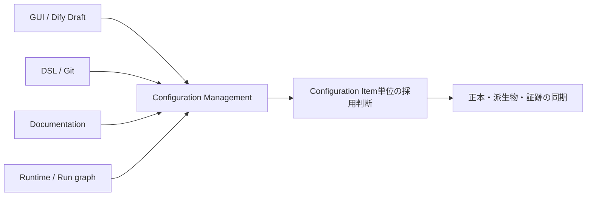

## 5. 全体アーキテクチャ

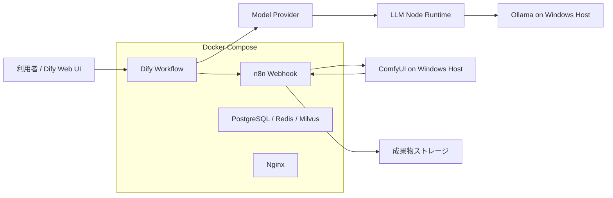

## 6. 7段階Agent構成と各責務

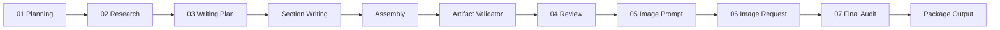

| Stage | 責務 |
|---|---|
| Planning | 入力から制作ブリーフ、調査質問、執筆条件を作る |
| Research | 既知情報、要確認事項、執筆可能な材料、避ける主張を整理する |
| Writing | 本文なしのPlan、独立Section、意味非生成Assembly、配布メタデータを生成する |
| Review | Writing成果物を最小Review DTOで受け、合否・問題・修正方針を返す |
| Image Prompt | ComfyUI向けの著作権配慮済み英語プロンプトを作る |
| Image Generation Request | n8n/ComfyUI向けの画像生成要求を構成する |
| Final Audit | 最小Audit DTOを受け、公開前の合否と注意点を返す |

### LLM Runtime Parameters（実行時設定）

DifyではModel Providerの設定と各LLMノードの実行時設定を分離して管理する。

長文処理ではProvider既定値だけに依存せず、各LLMノードの役割に応じてContext Window、推論モード、出力上限等を明示的に管理する。具体的な設定値と障害切り分け手順は内部仕様とする。

## 7. Agent間通信モデル

PlanningとResearchでは、LLM raw
textを直後のNormalizeだけが読み、後続はNormalize済みDTOを参照する。WritingはPlanと複数Sectionへ分割し、各Sectionを独立して検証する。Reviewにも独立した契約判定を持たせ、PackageによるStage救済を禁止する。Final
Auditは記事全文、Validator結果、Review、画像要求、Package事前状態を受ける。

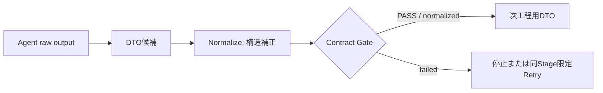

## 8. DTOの役割

DTOはAgentの創造内容を規定するものではなく、後続が機械的に読める境界を定める。必須/任意、型、空許容、利用者、違反時動作を明記する。詳細は
[DTO契約仕様](dify-dto-contracts.md) を正本とする。

## 9. Normalizeの役割

Normalizeは型変換、空値正規化、既存フィールドの階層移動、固定stageの構造補正を行う。未生成の要約、事実、成功条件等を作らない。Planningで許可されたStart入力からの補完は、元のユーザー要求を同義フィールドへ確定する限定処理である。

## 10. Contract Gateの役割

Gateは必須項目、型、空値、固定値を検査し、PASS/FAILと違反理由を返す。DTOを修正しない。Planning失敗はResearch前、Research失敗はWriting前で止める。

## 11. Research限定Retry

Research DTOの契約違反だけを対象に、最大1回の再生成を行う。循環エッジを使わない有限グラフとし、初回PASS時はRetryしない。再生成後も契約を満たさない場合はWorkflowを停止する。

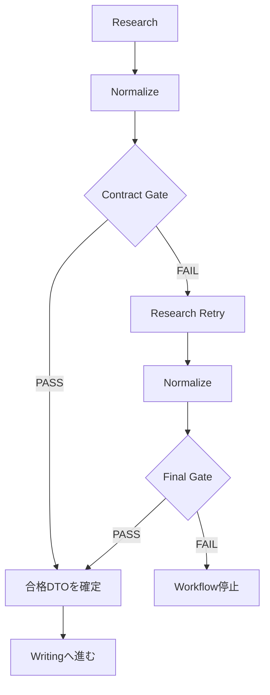

Retry制御情報はResearch DTOへ混入させず、業務データと監査情報を分離する。Retry Contextの内部項目、監査形式、Error Code、保存先は内部仕様とする。

## 12. Section WritingとArtifact Integrity（成果物完全性）

Writing Planは本文を書かず、Section構成、各Sectionの役割、論点、目標文字数、結論方向を定義する。本文はSection単位で独立生成・検証し、契約を満たさないSectionだけを同一Stage内で限定的に再生成する。

Assemblyは見出し、順序、改行、Markdown外形だけを扱い、文章追加・削除・要約・補完を行わない。Artifact Validatorは組み立て後の成果物が公開可能な状態かを検査し、FAIL時はReview、Final Audit、保存へ進めない。具体的なSection数、縮退方式、再生成条件、検査項目、Error Codeは内部仕様とする。詳細な採用理由は
[ADR-0006](adr/ADR-0006-artifact-integrity-validation.md) と
[ADR-0007](adr/ADR-0007-section-based-writing.md) を参照する。

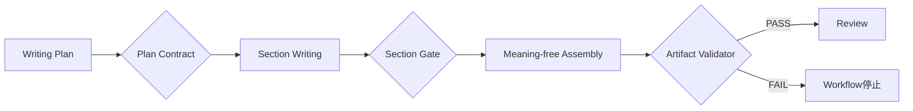

## 13. Package Output Final Guard（最終防御）

外部送信直前に、主要成果物が公開・保存可能な状態かを再検査する。Artifact Validatorの代替ではなく最終防波堤であり、前段Stageの契約違反をPackageで救済しない。具体的な再検査項目は内部仕様とする。

## 14. Difyからn8nへのTransport（転送）

Difyは成果物PackageをJSONとしてn8nへ送信する。n8nは受信データを実行単位で分離し、保存処理と画像生成処理へ安全に引き渡す。大容量Payloadを実行環境の制約から切り離し、途中状態を完成成果物として扱わないTransport境界を設ける。

具体的なWebhook URL、内部パス、一時ファイル方式、実行コマンド、入力互換方式は内部仕様とする。

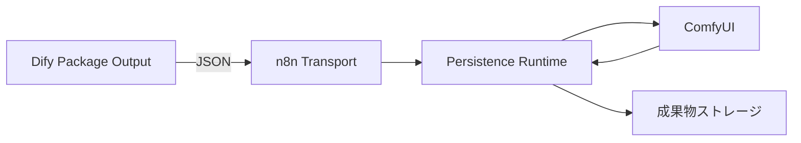

## 15. 原子的なPersistence（永続化）

成果物は実行単位で分離し、検証が完了するまで中間状態を完成成果物として公開しない。保存後に内容と構成を再検証し、同名成果物や並行実行による衝突を避ける。保存処理の途中で失敗した場合も、既存成果物を破壊しない。

具体的なstaging方式、rename手順、採番規則、再検証項目、実行識別子は内部仕様とする。

## 16. ComfyUI画像生成

n8nの実行処理がComfyUIへ画像生成要求を送り、生成状態を追跡して完成画像を成果物Packageへ保存する。利用可能な生成設定との差異は送信前に検証し、画像生成だけが失敗した場合は、主要なテキスト成果物の成功と画像生成失敗を分離して扱う。

具体的なAPIエンドポイント、poll方式、取得手順、checkpoint・sampler・schedulerの正規化方式は内部仕様とする。

## 17. 起動・停止・Health Check（稼働確認）

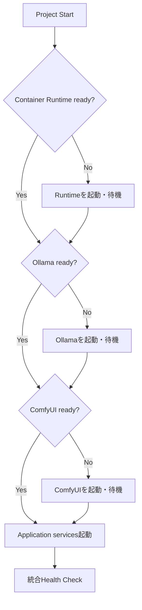

起動処理は依存サービスを順序立てて確認し、必要なコンポーネントだけを起動する。停止処理は共有サービスへの影響を避ける。具体的なスクリプト名、待機条件、プロセス判定、停止対象は内部運用仕様とする。

## 18. Workflow成功と成果物成功の違い

DifyがEndへ到達しただけでは、記事、X投稿、タグ、保存、画像生成の成功を意味しない。Workflow状態、外部処理の応答、保存結果、実成果物を合わせて確認する。主要成果物の保存成功と付随処理の失敗は、明示的に分離した状態として扱う。

## 19. Error Codeと監査ログ

Error Codeの発生条件、Retry可否、Operator対応は [Error
Catalog](error-catalog.md)
を正本とする。契約判定、Retry、Agent間受け渡し、保存・画像生成結果は、用途別の監査情報として分離して残す。具体的なファイル名、内部JSON構造、保存先は内部仕様とする。巨大本文を運用ログへ重複出力しない。

打鍵レビュー、実運用レビュー、品質レビューは [Review Knowledge
Base](reviews/README.md) にProject
Knowledgeとして恒久保存する。各指摘へ`Open`、`Closed`、`Resolved`、`Won't Fix`を付け、設計変更が生じた場合はレビューを起点としてADR、Error
Catalog、Workflow、関連Documentationへ追跡可能な形で反映する。レビュー単体は修正完了後も削除しない。

## 20. State Machine（状態遷移）

Workflow全体の運用状態を次のように扱う。DifyのEnd到達と成果物成功を同一状態にしない。

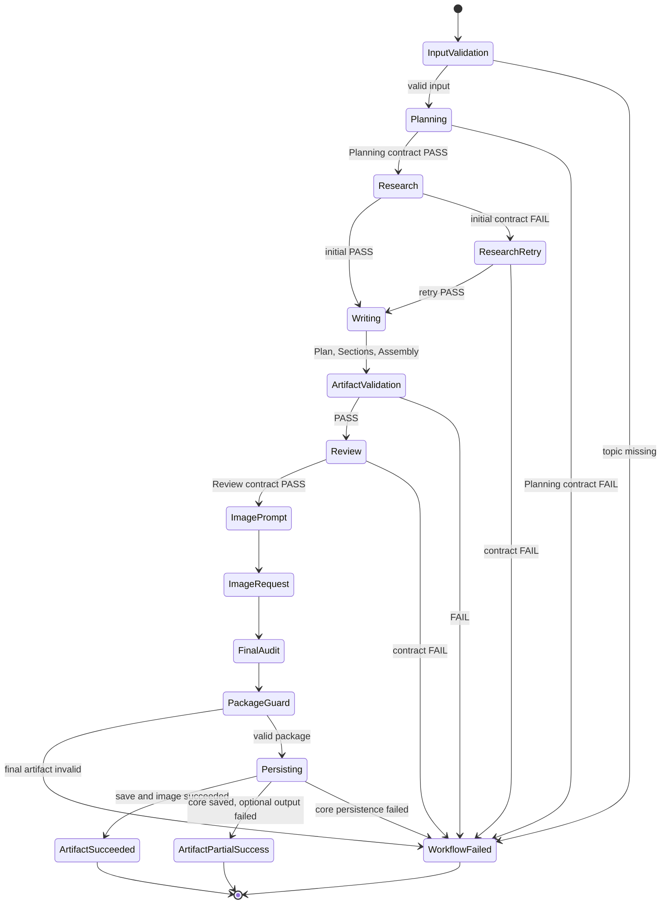

`ArtifactPartialSuccess`
は主要成果物が保存済みで一部の付随処理だけが失敗した状態である。自動的に完全成功へ読み替えない。

## 21. Responsibility Matrix（責務対応表）

Rは実行責任、Aは最終責任、Cは参照、Iは通知・証跡受領を表す。実装上のコンポーネント責務であり、組織上の職位を表さない。

| 活動 | Dify Agent | Normalize | Contract Gate | Package Output | n8n runtime | ComfyUI | Operator |
|---|---|---|---|---|---|---|---|
| 意味内容の生成 | R/A | I | I | I | I | I | C |
| DTO構造補正 | I | R/A | C | I | I | I | I |
| DTO合否判定 | I | C | R/A | C | I | I | I |
| Research再生成 | R | C | A | I | I | I | I |
| 最終成果物Guard | I | I | C | R/A | I | I | I |
| Transport受信 | I | I | I | C | R/A | I | I |
| 安全な保存・検証 | I | I | I | C | R/A | I | I |
| 画像生成 | I | I | I | C | C | R/A | I |
| 障害調査・再実行判断 | I | I | I | I | C | C | R/A |

Normalizeが意味内容、Gateが修正、n8nがDTO意味生成を担当することはない。

## 22. Data Flow Diagram（データフロー図）

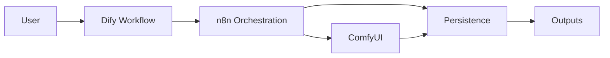

Difyは生成と契約判定、n8nは外部処理の調停、ComfyUIは画像生成、Persistenceは成果物保存を担当する。Transportの中間表現と内部実行経路は公開対象外とする。

## 23. Sequence Diagram（シーケンス図）

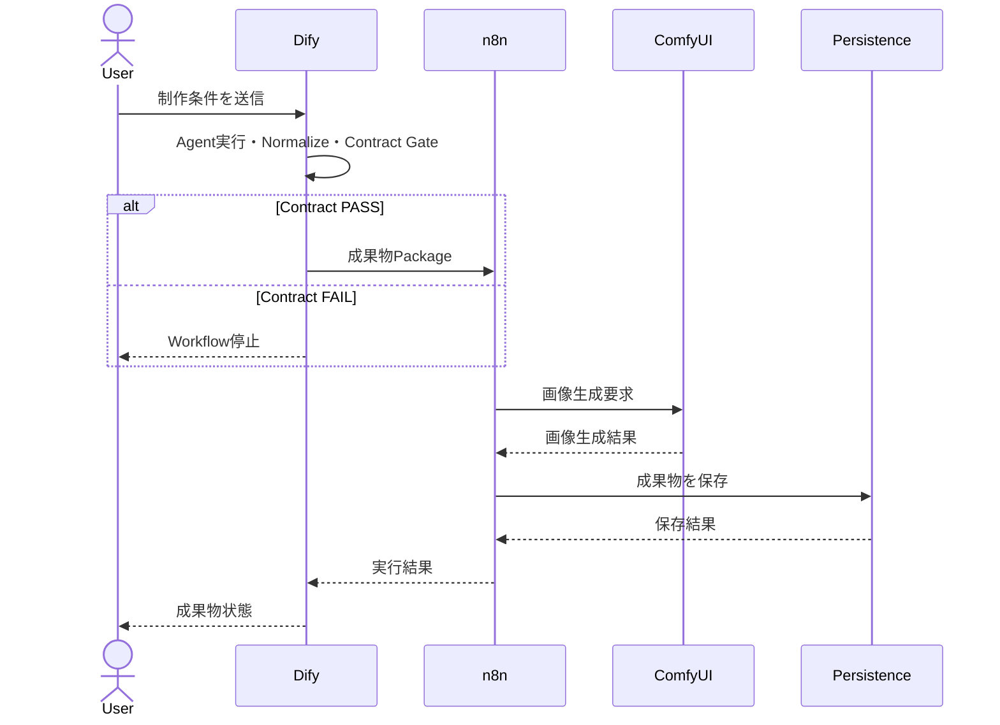

## 24. 設計思想の変遷

| 段階 | 発見した問題 | 設計上の対応 |
|---|---|---|
| 初期7段階Workflow | raw JSONと巨大コンテキストで後続AgentがStageを誤認 | Review/Audit向け最小DTOを導入 |
| Contract Phase 1 | Workflow完走でも空記事・固定値が成功扱い | Package Output Final Guardを追加 |
| Contract Phase 2 | Planning/Researchの必須値欠落が後段へ波及 | DTO、Normalize、Contract Gateを分離 |
| Research障害対応 | 正常なGate停止にも人間の再打鍵が必要 | 最大1回の有限Research Retryを追加 |
| Persistence障害対応 | 大容量Payloadが実行環境の制約に抵触 | 分離Transportと原子的Persistenceを採用 |
| Artifact Integrity Phase | 長文途中切断とReview Stage逸脱が保存成功扱い | Section Writing、Artifact Validator、Review有限Retry、全文Auditを導入 |
| Context Window調査 | Provider設定だけでは長文処理の実行時制約を回避できなかった | 各LLMノードの実行時設定を明示管理（ADR-0008） |

判断理由の詳細は [ADR一覧](adr/) を参照する。

## 25. DTO Version方針

-   field追加は、任意かつ既存consumerが無視できる場合に限り後方互換とする
-   必須field追加、型変更、意味変更、階層移動は破壊的変更とする
-   破壊的変更時は明示的なversion表現または新DTO名を採用する
-   Normalizeは旧versionの意味を推測して新versionへ変換しない。明示的なmigration ruleだけを許可する
-   DTO契約変更は [dify-dto-contracts.md](dify-dto-contracts.md) と関連テストを同時更新し、意味変更は必要に応じてADRで記録する

現行のversion付与状況と移行計画は内部ロードマップで管理する。

## 26. Error Code Version方針

Error
Codeはログ文言ではなく機械判定用インターフェースとして扱う。既存Codeの意味を変更せず、意味またはOperator対応が非互換に変わる場合は新Codeを追加する。廃止はDeprecated期間を設ける。命名、一覧、Retry可否の正本は
[Error Catalog](error-catalog.md) とする。

## 27. テスト戦略

-   静的テスト: 構文、参照、到達性、実行コード、出力定義
-   Contract単体テスト: 正常系、契約違反、限定Retry、意味転用禁止、有限グラフ
-   Transport/Persistenceテスト: 入力規模、文字種、破損入力、並行実行、保存整合性
-   統合テスト: Dify、n8n、ComfyUI、成果物保存の連携
-   手動確認: Provider解決、UI実行履歴、最終成果物の意味品質

具体的なfixture、境界値、内部エンドポイント、試験データ、完了判定手順は内部テスト仕様とする。

## 28. 現在の実装状況

現在の実装状況、Stage別の契約適用範囲、未完了項目、次の作業は内部のProject Statusおよびロードマップで管理する。

公開版Architectureでは、進行中の実装差分、未完成箇所、内部優先順位、Stage別の詳細な実装表は公開しない。

## 29. 未実装項目

未実装項目、依存関係、完了条件は内部ロードマップで管理する。公開版Architectureでは個別項目を列挙しない。

## 30. 将来拡張

将来拡張時も、本書で定義したDTO Boundary、責務分離、有限Retry、Artifact Integrityを維持する。具体的な候補、優先順位、時期は内部ロードマップで管理する。

## 31. 関連文書

-   [README](../README.md)
-   [Documentation Map](README.md)
-   [基本原則](principles.md)
-   [Configuration Management](configuration-management.md)
-   [用語集](glossary.md)
-   [DTO契約仕様](dify-dto-contracts.md)
-   [Error Catalog](error-catalog.md)
-   [Architecture Decision Records](adr/)
-   [Operational Review一覧](reviews/index.md)

内部のConfiguration Registry、Audit証跡、実装・試験手順、Handover、進行中のロードマップは公開版の関連文書一覧へ含めない。
