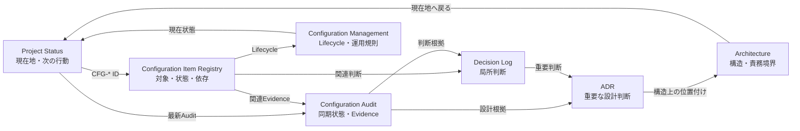

# Local AI Foundry Documentation

> **Public Edition**
>
> このディレクトリは公開版ドキュメントです。内部運用資料・環境固有情報・実装詳細への導線は公開対象のみへ調整しています。

このディレクトリは、設計、契約、判断、運用、品質証跡へ辿るための入口である。READMEは導線、各リンク先は担当領域の正本とする。実装の正本はDify DSL、n8n Workflow/runtime、起動・停止スクリプトである。

- [Project Status](status-public.md): 現在状態だけを示すProject Dashboard

## 目的別Navigation

| 目的 | 最初に開く文書 | 次に確認する根拠 |
|---|---|---|
| 現在地と次の行動を知る | [Project Status](status-public.md) | Dashboard内のConfiguration Item IDと最新Audit |
| `CFG-*`の意味、状態、依存を知る | Configuration Item Registry | Item行の「根拠へ進む」導線 |
| 同期状態とEvidenceを確認する | Configuration Audit一覧 | 対象Audit本文 |
| 判断理由を確認する | Decision Log | 関連ADR、Review |
| 重要な設計判断を確認する | [ADR一覧](adr/) | [Architecture](architecture-public.md)の対象責務 |
| 構造と責務境界を理解する | [Architecture](architecture-public.md) | 原則、DTO契約、運用仕様 |
| Configuration Lifecycleに従って作業する | Configuration Management | Audit運用規則、Definition of Done |
| 用語や表記を調べる | 用語集 | Documentation Style Guide |

固定IDが分かっている場合は、全文検索より先にDashboardまたは各一覧のIDリンクを使用する。
固定IDが分からない場合は、この表から目的に対応する正本へ進む。

## Documentation Navigation構成

矢印は情報の複製方向ではなく、利用者が次に確認する文書を示す。各Nodeの情報責務は
下記「正本管理」から変更しない。

## はじめに

- [基本原則](principles-public.md): 設計思想の正本
- [全体設計](architecture-public.md): システム構成とデータフロー
- 用語集: プロジェクト固有用語の正本
- Documentation Style Guide: Documentationの表記・変更記録ルール

## 設計

- [Project Status](status-public.md): Current Snapshotと作業Queue
- DTO契約: field、Normalize、Contract Gate
- Configuration Management: GUI、Draft、DSL、Git、Documentation、Runtimeの構成管理
- Configuration Item Registry: Configuration Item ID、Owner、Statusの唯一の正本
- [Architecture Decision Records](adr/): 重要な設計判断
- 判断記録: 小規模・運用判断
- エラーコード一覧: Error CodeとOperator対応

## 実装・運用

- Configuration Audit一覧
- Definition of Done
- Codex Standard Operating Procedure
- Dify Import & Test
- Dify → n8n → ComfyUI出力パイプライン
- Dify Ollama Provider
- Ollama / Dify Setup
- Manual Verification
- MCP Extension

## 品質・証跡

- [Operational Review規約](reviews/README.md)
- [Operational Review一覧](reviews/index.md)
- E2E Evidence
- Handover一覧

## 将来計画

- 開発ロードマップ

## 正本管理

| 領域 | 正本 |
|---|---|
| 実装 | `workflows/dify/`、`workflows/n8n/`、実行スクリプト |
| 現在地 | [status-public.md](status-public.md) |
| 原則 | [principles-public.md](principles-public.md) |
| 構成管理 | configuration-management.md |
| Configuration Item | configuration-items.md |
| 構成監査履歴 | configuration-audits/ |
| 完了条件 | definition-of-done.md |
| Codex作業手順 | codex-standard-operating-procedure.md |
| 全体構成 | [architecture-public.md](architecture-public.md) |
| 契約 | dify-dto-contracts.md |
| 用語 | glossary.md |
| Documentation表記 | documentation-style.md |
| Error Code | error-catalog.md |
| 重要判断 | [adr/](adr/) |
| 小規模判断 | decisions.md |
| 実運用知識 | [reviews/](reviews/) |
| 時点情報 | handover/ |
