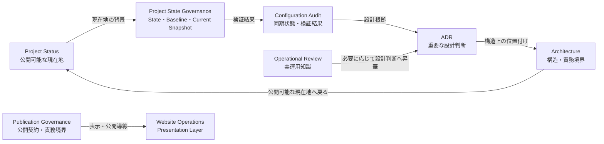

# Local AI Foundry Documentation

> **Public Edition**
>
> このディレクトリは、Local AI Foundryの公開ドキュメント入口である。
> 内部運用資料、環境固有情報、非公開Evidence、実装上の識別情報は含めない。

このページでは、公開済みの設計、判断、Publication Contract、Configuration Audit、Operational Reviewへ辿るための導線だけを提供する。

Internal Repositoryだけを唯一の正本とし、このPublic Repositoryに配置されたDocumentationは公開成果物として扱う。

Internal Publication Review RegistryおよびPublication Reflection Register（PRR）は内部管理専用であり、Public Repositoryには配置しない。

## 最初に読む

* [Project Status](status-public.md): 公開可能な範囲で、現在地と次の主要Gateを確認する
* [Architecture](architecture-public.md): システム全体の構造と責務境界を確認する
* [Publication Governance](../governance/publication-governance.md): 公開契約、責務境界、分類、公開フローを確認する
* [Project State Governance Audit](configuration-audits/CFG-20260801-001-project-state-governance.md): Project State、Current Snapshot、Baseline、Human Authorizationの考え方を確認する
* [Configuration Audit一覧](configuration-audits/index.md): 公開済みConfiguration Auditを確認する
* [Operational Review一覧](reviews/index.md): 実運用で観測された事象と知見を確認する
* [ADR一覧](adr/): 重要な設計判断を確認する

## 目的別Navigation

| 目的                                    | 最初に開く文書                                                                                             | 次に確認する文書                                                                                            |
| ------------------------------------- | --------------------------------------------------------------------------------------------------- | --------------------------------------------------------------------------------------------------- |
| 現在地と次の行動を知る                           | [Project Status](status-public.md)                                                                  | [Project State Governance Audit](configuration-audits/CFG-20260801-001-project-state-governance.md) |
| Project StateとCurrent Snapshotの考え方を知る | [Project State Governance Audit](configuration-audits/CFG-20260801-001-project-state-governance.md) | [Project Status](status-public.md)                                                                  |
| 公開契約と責務境界を知る                          | [Publication Governance](../governance/publication-governance.md)                                   | [Website Operations](website-operations-public.md)                                                  |
| 公式サイトの表示・導線・Release運用を確認する            | [Website Operations](website-operations-public.md)                                                  | [Publication Governance](../governance/publication-governance.md)                                   |
| 公開済みの構成監査結果を確認する                      | [Configuration Audit一覧](configuration-audits/index.md)                                              | 対象Audit本文                                                                                           |
| 重要な設計判断を確認する                          | [ADR一覧](adr/)                                                                                       | [Architecture](architecture-public.md)                                                              |
| 構造と責務境界を理解する                          | [Architecture](architecture-public.md)                                                              | 関連ADR、Configuration Audit                                                                           |
| 実運用で得られた知見を確認する                       | [Operational Review一覧](reviews/index.md)                                                            | 対象Review本文                                                                                          |

## Documentation Navigation構成

```mermaid
flowchart LR
    Status["Project Status<br/>公開可能な現在地"]
    ProjectState["Project State Governance<br/>State・Baseline・Current Snapshot"]
    PublicationGovernance["Publication Governance<br/>公開契約・責務境界"]
    Website["Website Operations<br/>Presentation Layer"]
    Audit["Configuration Audit<br/>同期状態・検証結果"]
    ADR["ADR<br/>重要な設計判断"]
    Architecture["Architecture<br/>構造・責務境界"]
    Review["Operational Review<br/>実運用知識"]

    Status -->|"現在地の背景"| ProjectState
    ProjectState -->|"検証結果"| Audit
    PublicationGovernance -->|"表示・公開導線"| Website
    Audit -->|"設計根拠"| ADR
    ADR -->|"構造上の位置付け"| Architecture
    Review -->|"必要に応じて設計判断へ昇華"| ADR
    Architecture -->|"公開可能な現在地へ戻る"| Status
```

矢印は情報の複製方向ではなく、公開利用者が次に確認する文書を示す。

Publication GovernanceとWebsite Operationsは相互に代替しない。

* Publication Governance: 公開契約
* Website Operations: Presentation Layer

Internal Publication Review RegistryおよびPRRは内部管理専用であり、このPublic Navigationには含めない。

## 公開ドキュメント

### はじめに

* [基本原則](principles-public.md): 設計思想
* [Architecture](architecture-public.md): システム構成とデータフロー
* [Project Status](status-public.md): 公開可能なCurrent Snapshot

### Publication

* [Publication Governance](../governance/publication-governance.md): 公開契約、分類、責務境界、公開フロー
* [Website Operations](website-operations-public.md): 公式ホームページのPresentation Layer、導線、VersionおよびRelease運用

Internal Publication Review RegistryおよびPublication Reflection Register（PRR）は内部管理専用であり、Public Repositoryには配置しない。

### 設計・判断

* [ADR一覧](adr/): 重要な設計判断
* [Project State Governance Audit](configuration-audits/CFG-20260801-001-project-state-governance.md): Project State Governance導入の公開実例

### Configuration Audit

* [Public Configuration Audit](configuration-audits/README.md): 公開版Auditの考え方とマスク方針
* [Configuration Audit一覧](configuration-audits/index.md): 公開済みAuditの索引

### Operational Review

* [Operational Review規約](reviews/README.md)
* [Operational Review一覧](reviews/index.md)

## Publication Responsibility

| 領域                                   | 責務                                                             |
| ------------------------------------ | -------------------------------------------------------------- |
| Internal Repository                  | 唯一の正本                                                          |
| Publication Governance               | 公開契約・公開統制                                                      |
| Internal Publication Review Registry | 各管理対象のCurrent Publication Review。Public Repositoryには配置しない      |
| PRR                                  | 公開成果物から確認できなくなるPublication Review判断履歴。Public Repositoryには配置しない |
| Public Repository                    | 承認済み公開成果物                                                      |
| Website                              | Presentation Layer、概要、告知、公開導線                                  |

Public RepositoryまたはWebsiteをInternal Repositoryの正本の代替として扱わない。

Internal Publication Review RegistryまたはPRRの内容をPublic RepositoryやWebsiteへ複製しない。

## 公開版の範囲

公開版には、利用者が設計思想、責務境界、公開契約、判断理由および公開済み監査結果を理解するために必要な情報を掲載する。

次の情報は削除または一般化する。

* App ID、Workflow ID、Draft ID、Run ID
* Commit SHA、hash、fingerprint
* ローカル環境path、内部Repository path
* Database情報、認証情報、接続情報
* Repository外の承認記録全文
* 内部Working Treeの具体的差分
* 非公開Evidenceの詳細
* Internal Publication Review Registryの内容
* PRRの内容
* 公開対象一覧および内部Review Current State

公開対象としなかった文書や、公開成果物またはGit履歴から確認できなくなる不採用・保留・Mask・Generalization・委譲判断は、公開物ではなく内部のPRRで管理する。

各管理対象の現在有効なPublication Review結果は、内部のPublication Review Registryで管理する。

不採用・保留、Mask・Generalization・委譲その他の公開成果物から確認できなくなる判断が存在しない単純公開では、PRRを作成しない。

## Navigation Verification

本ページの更新は次を確認して完了とする。

* Publication Governanceへのリンクが有効である。
* Website Operationsへのリンクが有効である。
* 削除済みPublication Registryへのリンクが存在しない。
* Internal Publication Review Registryへの公開リンクが存在しない。
* PRRへの公開リンクが存在しない。
* Internal Repositoryだけが正本であることを明示している。
* Public Repositoryを公開成果物、WebsiteをPresentation Layerとして扱っている。
* 公開対象一覧または内部Review Current StateをPublic Documentationへ保持していない。
* 各文書の責務が重複していない。
