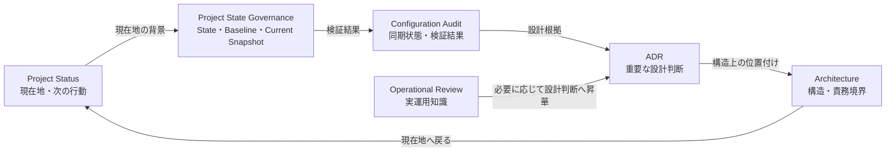

# Local AI Foundry Documentation

> **Public Edition**
>
> このディレクトリは、Local AI Foundryの公開ドキュメント入口である。
> 内部運用資料、環境固有情報、非公開Evidence、実装上の識別情報は含めない。

このページでは、公開済みの設計、判断、Configuration Audit、Operational Reviewへ辿るための導線だけを提供する。

## 最初に読む

- [Project Status](status-public.md): 公開可能な範囲で、現在地と次の主要Gateを確認する
- [Architecture](architecture-public.md): システム全体の構造と責務境界を確認する
- [Project State Governance Audit](configuration-audits/CFG-20260801-001-project-state-governance.md): Project State、Current Snapshot、Baseline、Human Authorizationの考え方を確認する
- [Configuration Audit一覧](configuration-audits/index.md): 公開済みConfiguration Auditを確認する
- [Operational Review一覧](reviews/index.md): 実運用で観測された事象と知見を確認する
- [ADR一覧](adr/): 重要な設計判断を確認する

## 目的別Navigation

| 目的 | 最初に開く文書 | 次に確認する文書 |
|---|---|---|
| 現在地と次の行動を知る | [Project Status](status-public.md) | [Project State Governance Audit](configuration-audits/CFG-20260801-001-project-state-governance.md) |
| Project StateとCurrent Snapshotの考え方を知る | [Project State Governance Audit](configuration-audits/CFG-20260801-001-project-state-governance.md) | [Project Status](status-public.md) |
| 公開済みの構成監査結果を確認する | [Configuration Audit一覧](configuration-audits/index.md) | 対象Audit本文 |
| 重要な設計判断を確認する | [ADR一覧](adr/) | [Architecture](architecture-public.md) |
| 構造と責務境界を理解する | [Architecture](architecture-public.md) | 関連ADR、Configuration Audit |
| 実運用で得られた知見を確認する | [Operational Review一覧](reviews/index.md) | 対象Review本文 |
| 公式サイトの公開・更新方針を確認する | [Website Operations](website-operations-public.md) | 公開対象Documentation |

## Documentation Navigation構成

```mermaid
flowchart LR
    Status["Project Status<br/>現在地・次の行動"]
    ProjectState["Project State Governance<br/>State・Baseline・Current Snapshot"]
    Audit["Configuration Audit<br/>同期状態・検証結果"]
    ADR["ADR<br/>重要な設計判断"]
    Architecture["Architecture<br/>構造・責務境界"]
    Review["Operational Review<br/>実運用知識"]

    Status -->|"現在地の背景"| ProjectState
    ProjectState -->|"検証結果"| Audit
    Audit -->|"設計根拠"| ADR
    ADR -->|"構造上の位置付け"| Architecture
    Review -->|"必要に応じて設計判断へ昇華"| ADR
    Architecture -->|"現在地へ戻る"| Status
```

矢印は情報の複製方向ではなく、公開利用者が次に確認する文書を示す。

## 公開ドキュメント

### はじめに

- [基本原則](principles-public.md): 設計思想
- [Architecture](architecture-public.md): システム構成とデータフロー
- [Project Status](status-public.md): 公開可能なCurrent Snapshot
- [Website Operations](website-operations-public.md): 公式ホームページと公開運用方針

### 設計・判断

- [ADR一覧](adr/): 重要な設計判断
- [Project State Governance Audit](configuration-audits/CFG-20260801-001-project-state-governance.md): Project State Governance導入の公開実例

### Configuration Audit

- [Public Configuration Audit](configuration-audits/README.md): 公開版Auditの考え方とマスク方針
- [Configuration Audit一覧](configuration-audits/index.md): 公開済みAuditの索引

### Operational Review

- [Operational Review規約](reviews/README.md)
- [Operational Review一覧](reviews/index.md)

## 公開版の範囲

公開版には、利用者が設計思想、責務境界、判断理由、監査結果を理解するために必要な情報を掲載する。

次の情報は削除または一般化する。

- App ID、Workflow ID、Draft ID、Run ID
- Commit SHA、hash、fingerprint
- ローカル環境path、内部Repository path
- Database情報、認証情報、接続情報
- Repository外の承認記録全文
- 内部Working Treeの具体的差分
- 非公開Evidenceの詳細

公開対象としなかった文書やマスク判断は、公開物ではなく内部のPublication Reflection Registerで管理する。
