# Local AI Foundry Public Architecture

## 1. 文書の目的

本書は、Local AI Foundryの構成、境界、Workflow、主要データフローを公開するためのArchitecture文書である。

本書はInternal Architectureを唯一の正本とする公開派生物であり、公開のために必要なMask、Generalization、文章調整だけを行う。公開版独自のArchitecture、Current State、実装計画、運用判断は保持しない。

公開文書の関係は次のとおりである。

- 設計思想の公開入口: [基本原則](principles-public.md)
- 用語の公開Reference: [Glossary](glossary-public.md)
- 将来方向の公開Reference: [Project Roadmap](roadmap-public.md)
- Public Documentation全体の入口: [Public Documentation Map](README-public.md)

Internal Repository固有Path、Working Evidence、Private Artifact、Configuration ID、時点付き実行値、内部運用手順、未公開文書への直接導線は公開対象外とする。公開内容とInternal正本が食い違う場合はInternal正本を基準として本書を更新する。

## 2. Local AI Foundryの概要

Local AI Foundryは、人間がPurpose、Judgment、Responsibility、Approvalを保持し、明示した責務境界の内側でAIへ業務を委譲するHuman-Directed Foundryである。Contract、DTO / Handoff、Validation、Gate、Review、EvidenceおよびHuman Gateによって、Workflow完走ではなく成果物の成立を制御する。

Article ProductionはReference Implementation #1（RI#1）のHistorical Benchmarkとして保存する。Documentation ProductionはRI#2、Visual Asset ProductionはRI#3、Research-Grounded Long-form ProductionはRI#4、Evidence FoundationはRI#5として比較Evidenceを提供する。RI#5はEvidenceの記録・追跡・改善支援を担うFoundry Control Planeである。FoundryConsoleはRI#3のHuman-facing Control Surface / Current Implementationであり、RIそのものではない。

Current Vectorは、Actual Human Runtimeで確認したRI #5 Evidence Foundationを基盤に、RI #4をEvidence-drivenに実打鍵・改善する段階へ移行している。Foundry CoreはCapability単位でHuman Decisionにより確定し、`FC-CORE-001`〜`FC-CORE-004`の4件が現在確認済みである。その他の再利用可能なPatternはCore Candidateのままである。

RI #4のArticle Quality Hardeningは既存production pipelineへ新しいstageを足さず、Runtime EvidenceからFinding、構造的Failure Family、Correction、Regression、Closureを結ぶ開発統制として機能する。RI #5はEvidence authority / protected baseを維持し、次の公開マイルストーンはArticle Quality Baselineである。

## 2.1 責務階層

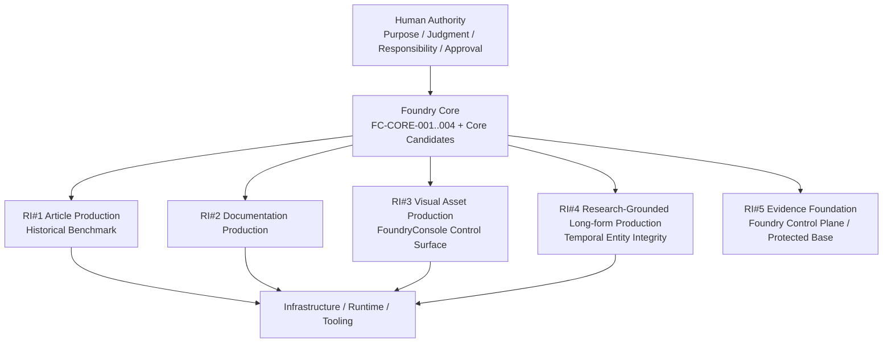

Human AuthorityはFoundry Control Modelと各Reference Implementationの上位責務である。AI DelegationはHuman Authority Boundaryを越えず、Purposeの設定、最終判断、責任、Approval / Human Gateを代替しない。

確認済みFoundry Coreは次の4件である。

| Core ID | Capability | Semantic Boundary |
|---|---|---|
| `FC-CORE-001` | Runtime Capability Calibration | Current Model / Runtime / Hardware capabilityを観測・実測し、Evidence-backed Effective Capabilityとして確定し、後続処理へBindingする |
| `FC-CORE-002` | Delegation Contract Binding | 委譲前に必要成果、制約、責任・権限境界、Handoff、失敗条件を識別可能なContractへBindingする |
| `FC-CORE-003` | Deterministic Technical Gate | Actual Artifact / Runtime StateをMachine-checkable条件で評価し、FAILをTechnical Successとして後段へ流さない |
| `FC-CORE-004` | Evidence Traceability | Execution、Artifact、Gate、Review、Human DecisionのEvidence identity / BindingとCurrent・Historical・Candidate区別を保存する |

FC-CORE-003はRetry / correction strategy、Human Acceptance、Reviewを含まない。FC-CORE-004はlive progress UI、dashboard、presentation、operational observabilityそのものを含まない。Review Binding Integrityは`CANDIDATE — STRONG`であり、確認済みCoreには含めない。

## 2.2 Reference Implementationの現在位置

| Reference Implementation | 位置付け | Current Evidence |
|---|---|---|
| RI#1 — Article Production | `FROZEN / HISTORICAL BENCHMARK`として実装と実行Evidenceを保存する | Article Production ArchitectureとHistorical Evidence |
| RI#2 — Documentation Production | Documentationを対象にControl Patternを実証する業務RI | 比較Evidenceを保持し、継続評価する |
| RI#3 — Visual Asset Production | Visual Asset Productionの業務RI。FoundryConsoleはHuman-facing Control Surface / Current Implementation | Visual Asset ProductionのHuman Runtime Evidence |
| RI#4 — Research-Grounded Long-form Production | Research-groundedな長文Content Productionの業務RI。Current Candidate v0.71 | AQC-01 ready / Article Quality Baseline not established / Evidence-driven hardening |
| RI#5 — Evidence Foundation | Producer RIの実行・判断・失敗をEvidenceとして記録・追跡し、改善を支えるFoundry Control Plane。Current Candidate v1.0.2 / LF-EKB v0.3 | Actual Human Runtimeで確認済みのEvidence Foundation / Terminal HOLD lifecycle / Current Evidence projection |

RI #1の凍結はEvidenceの破棄やAccepted化を意味しない。RI #2〜RI #5の状態もProject State Transitionを意味しない。FC-CORE-001〜004以外のCore CandidateをFoundry Coreに確定する場合は、別のHuman Decisionを必要とする。

## 3. 解決する課題

- 異なる業務へAIを委譲してもHuman AuthorityとResponsibility Boundaryを維持する
- Reference Implementation間の比較Evidenceから再利用可能なControl Patternを検証する
- LLM出力の揺らぎを、後続工程の暗黙知ではなくDTO契約で制御する
- 壊れた中間成果物をWorkflow成功として後段へ流さない
- 生成処理と、保存・外部実行処理を分離する
- 記事だけでなく、判断経路、契約判定、Retry履歴も保存する
- 複数のローカルServiceを一体として起動・停止し、到達性を確認する

## 4. 設計原則

設計思想の公開入口は[基本原則](principles-public.md)である。本書では、その原則をComponent境界とData Flowへ適用した結果だけを扱う。

### 4.1 Configuration Governance（構成管理統制）

GUI、Draft、DSL、Git、Documentation、Runtimeは同じ構成の異なる表現または実効状態であり、更新契機も異なる。

Local AI FoundryはこれらをWorkflow全体で一括同期せず、Graph、Prompt、Code、Contract、LLM Node Parameters、Provider Settings等のConfiguration Itemごとに正本と同期方向を判断する。

本章は構造上の位置付けだけを示し、具体的な状態分類、同期手順、Audit結果、内部運用契約は保持しない。

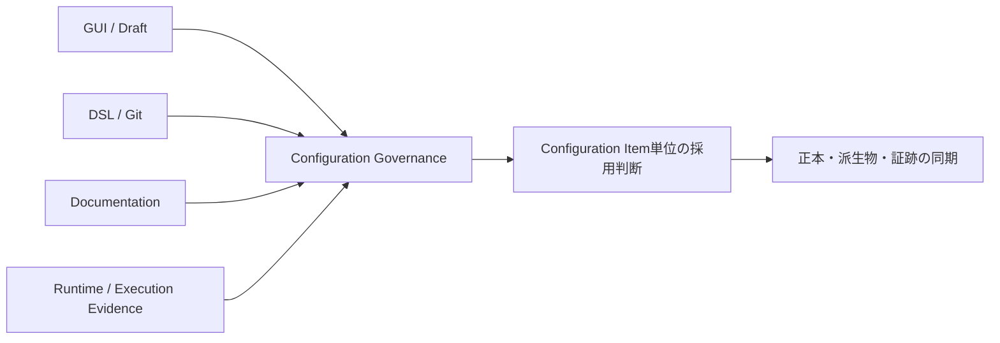

## 5. RI#1 Article Productionアーキテクチャ

本章以降のArticle、短文投稿、タグ、画像、保存に関する詳細はProject全体の唯一の業務定義ではなく、RI#1のFrozen実装を保存するHistorical Benchmark Architectureである。

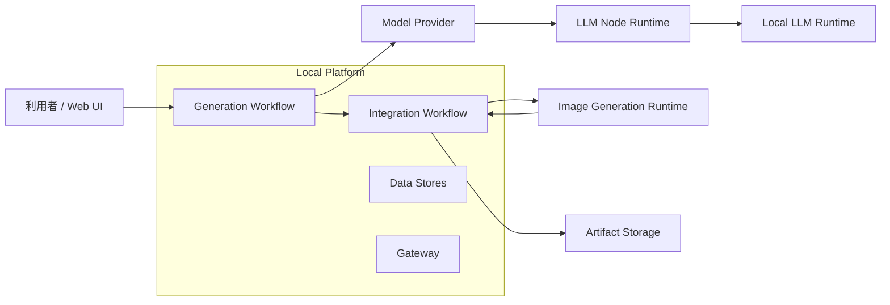

## 6. RI#1 7段階Agent構成と各責務

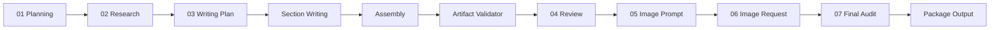

| Stage | 責務 |
|---|---|
| Planning | 入力から制作ブリーフ、調査質問、執筆条件を作る |
| Research | 既知情報、要確認事項、執筆可能な材料、避ける主張を整理する |
| Writing | 本文なしのPlan、独立Section、意味非生成Assembly、配布メタデータを生成する |
| Review | Writing成果物を最小Review DTOで受け、合否・問題・修正方針を返す |
| Image Prompt | 画像生成向けの著作権配慮済みプロンプトを作る |
| Image Generation Request | 画像生成実行に必要な要求を構成する |
| Final Audit | 最小Audit DTOを受け、公開前の合否と注意点を返す |

### LLM Runtime Parameters（実行時設定）

Model Providerの既定値と各LLM Nodeの実行時設定は分離して管理する。

長文処理ではProvider既定値だけに依存せず、各Nodeの役割に応じてContext Window、推論モード、出力上限等を明示的に管理する。

具体的な設定値、Node別割当、障害切り分け条件はInternal運用情報として本書では保持しない。

## 7. Agent間通信モデル

PlanningとResearchでは、LLM raw textを直後のNormalizeだけが読み、後続はNormalize済みDTOを参照する。

WritingはPlanと複数Sectionへ分割し、各Sectionを独立して生成・検証する。必要な再生成は同一Stage内の有限Retryとして扱う。Reviewにも独立した契約判定と有限Retryを持たせ、PackageによるStage救済を禁止する。Final Auditは記事全文、Validator結果、Review、画像要求、Package事前状態を受ける。

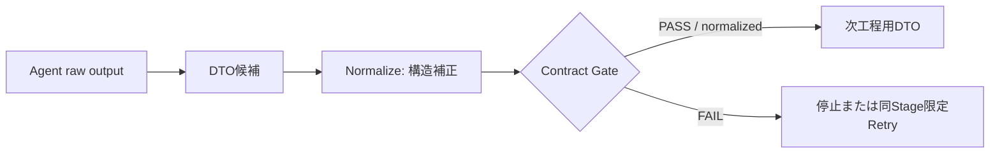

## 8. DTOの役割

DTOはAgentの創造内容を規定するものではなく、後続処理が機械的に読める境界を定める。

DTOでは、必須・任意、型、空値許容、利用者、違反時動作を明示する。具体的なField、Schema、内部契約文書は公開対象外とする。

## 9. Normalizeの役割

Normalizeは型変換、空値正規化、既存Fieldの階層移動、固定Stageの構造補正を行う。

Normalizeは未生成の要約、事実、成功条件等を新たに作らない。入力からの補完を許可する場合も、元の要求を同義Fieldへ確定する限定処理とする。

## 10. Contract Gateの役割

Contract Gateは必須項目、型、空値、固定値を検査し、PASSまたはFAILと違反理由を返す。

GateはDTOを修正しない。前段の契約違反を後段で救済せず、違反が確定したStageで停止または限定Retryへ進める。

## 11. Research限定Retry

Research DTOの契約違反だけを対象に有限回の再生成を行う。

循環Edgeを使わない有限Graphとし、初回PASS時はRetryしない。再生成後も契約を満たさない場合はWorkflowを停止する。

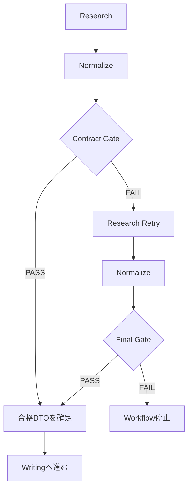

Retry制御情報はResearch DTOへ混入させず、業務データと監査情報を分離する。具体的なRetry Context、回数、監査Field、停止Code、保存先はInternal仕様とする。

## 12. Section WritingとArtifact Integrity（成果物完全性）

Writing Planは本文を書かず、Section構成、各Sectionの役割、論点、目標量、結論方向を定義する。

本文はSection単位で独立生成・検証し、契約を満たさないSectionだけを同一Stage内で限定的に再生成する。

Assemblyは見出し、順序、改行、Markdown外形だけを扱い、文章追加、削除、要約、補完を行わない。

Artifact Validatorは、組み立て後の成果物が公開可能な状態かを検査し、FAIL時はReview、Final Audit、保存へ進めない。

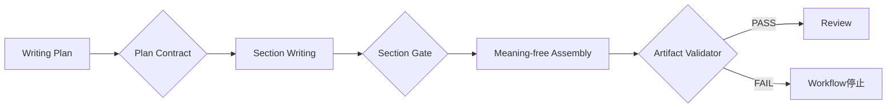

具体的なSection数、縮退方式、token budget、finish reason、再生成条件、検査項目、停止CodeはInternal仕様とする。

## 13. Package Output Final Guard（最終防御）

外部送信直前に、主要成果物が公開・保存可能な状態かを再検査する。

これはArtifact Validatorの代替ではなく最終防波堤であり、前段Stageの契約違反をPackageで救済しない。具体的な再検査Fieldと判定条件はInternal仕様とする。

## 14. Generation WorkflowからIntegration WorkflowへのTransport（転送）

Generation Workflowは成果物Packageを構造化データとしてIntegration Workflowへ送信する。

Integration Workflowは受信データを実行単位で分離し、保存処理と画像生成処理へ安全に引き渡す。大容量Payloadを実行環境の制約から切り離し、途中状態を完成成果物として扱わないTransport境界を設ける。

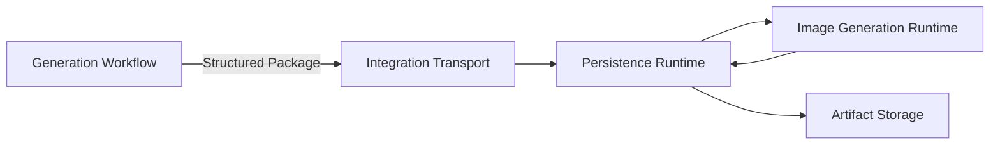

具体的なURL、Port、内部Path、一時保存方式、実行Command、入力互換方式はInternal仕様とする。

## 15. 原子的なPersistence（永続化）

成果物は実行単位で分離し、検証が完了するまで中間状態を完成成果物として公開しない。

保存後に内容と構成を再検証し、同名成果物や並行実行による衝突を避ける。保存処理の途中で失敗した場合も、既存成果物を破壊しない。

具体的なstaging方式、rename手順、採番規則、実行識別子、File検証詳細はInternal仕様とする。

## 16. 画像生成

Integration Workflowの実行処理が画像生成Runtimeへ要求を送り、生成状態を追跡して完成画像を成果物Packageへ保存する。

利用可能な生成設定との差異は送信前に検証する。画像生成だけが失敗した場合は、主要なテキスト成果物の成功と画像生成失敗を分離して扱う。

具体的なAPI Endpoint、poll方式、取得手順、Model設定の正規化方式はInternal仕様とする。

## 17. 起動・停止・Health Check（稼働確認）

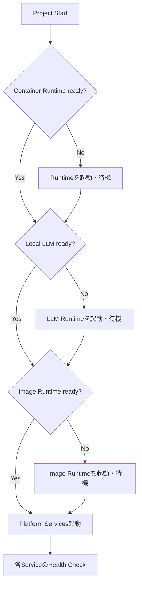

起動処理は依存Serviceを順番に確認し、未起動の場合だけ起動と待機を行う。

停止処理は本プロジェクトが管理するServiceを停止し、他用途と共有するRuntimeは運用境界に従って扱う。

具体的なScript名、Process条件、Port、Endpoint、待機時間、停止対象はInternal仕様とする。

## 18. Workflow成功と成果物成功の違い

WorkflowがEndへ到達しただけでは、記事、短文投稿、タグ、保存、画像生成の成功を意味しない。

Workflow結果、Package状態、保存結果、Integration Workflow応答、実ファイル、Metadataを合わせて確認する。

主要なテキスト成果物の保存には成功し、画像生成だけが失敗した場合は、完全成功と分離した部分成功として扱う。部分成功を自動的に完全成功へ読み替えない。

## 19. Error Codeと監査ログ

Error Codeは、発生条件、Retry可否、Operator対応を機械的に識別するためのInterfaceとして扱う。

監査情報は、契約判定、Retry、Agent間受け渡し、保存、画像生成結果を責務別に分離して残す。巨大本文を運用Logへ重複出力しない。

具体的なError Code、File名、保存Path、Log Schema、Operator手順はInternal仕様とする。

実運用で得られた知識はReviewとして保持し、設計変更が必要な場合は、判断記録、Architecture、Workflow、関連Documentationへ追跡可能な形で反映する。

## 20. State Machine（状態遷移）

Workflow全体の運用状態を次のように扱う。WorkflowのEnd到達と成果物成功を同一状態にしない。

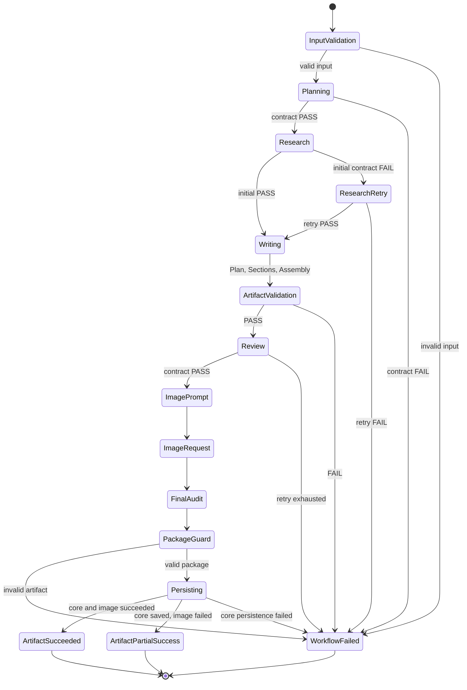

`ArtifactPartialSuccess`は主要成果物が保存済みで、付随処理だけが失敗した状態である。自動的に完全成功へ読み替えない。

## 21. Responsibility Matrix（責務対応表）

Rは実行責任、Aは最終責任、Cは参照、Iは通知・証跡受領を表す。実装上のComponent責務であり、組織上の職位を表さない。

| 活動 | Generation Agent | Normalize | Contract Gate | Package Output | Integration Runtime | Image Runtime | Operator |
|---|---|---|---|---|---|---|---|
| 意味内容の生成 | R/A | I | I | I | I | I | C |
| DTO構造補正 | I | R/A | C | I | I | I | I |
| DTO合否判定 | I | C | R/A | C | I | I | I |
| Research再生成 | R | C | A | I | I | I | I |
| 最終成果物Guard | I | I | C | R/A | I | I | I |
| Transport受信 | I | I | I | C | R/A | I | I |
| 原子的保存・検証 | I | I | I | C | R/A | I | I |
| 画像生成 | I | I | I | C | C | R/A | I |
| 障害調査・再実行判断 | I | I | I | I | C | C | R/A |

Normalizeが意味内容、Gateが修正、Integration RuntimeがDTO意味生成を担当することはない。

## 22. Data Flow Diagram（データフロー図）

```mermaid
flowchart LR
  UI["D1 User Input"] --> ID["P1 Input Normalize"]
  ID --> PA["P2 Planning Agent"]
  PA --> PC["D2 Planning DTO + Contract"]
  PC --> RA["P3 Research Stage"]
  RA --> RC["D3 Research DTO + Retry Audit"]
  RC --> WA["P4 Writing to Final Audit"]
  WA --> PO["P5 Package Output Guard"]
  PO --> NP["D4 Integration Package"]
  NP --> SP["D5 Transport Representation"]
  SP --> PS["P6 Persistence Runtime"]
  PS --> CF["E1 Image Runtime"]
  CF --> PS
  PS --> OUT["D6 Artifact Package"]
  OUT --> OP["E2 Operator"]
```

`D2`と`D3`は契約済み境界である。`D4`は最終成果物と監査情報を含むTransport DTO、`D5`はTransport上の一時表現であり業務DTOではない。

## 23. Sequence Diagram（シーケンス図）

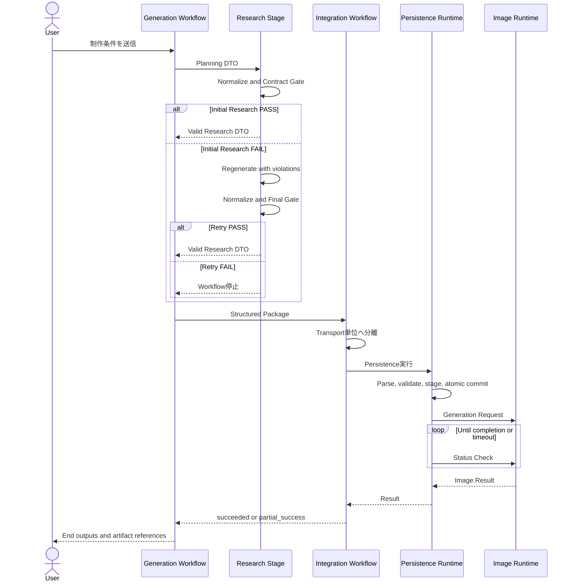

## 24. 設計思想の変遷

| 段階 | 発見した問題 | 設計上の対応 |
|---|---|---|
| 初期7段階Workflow | raw JSONと巨大Contextで後続AgentがStageを誤認 | Review、Audit向け最小DTOを導入 |
| Contract Phase 1 | Workflow完走でも不完全成果物が成功扱い | Package Output Final Guardを追加 |
| Contract Phase 2 | 前段の必須値欠落が後段へ波及 | DTO、Normalize、Contract Gateを分離 |
| Research障害対応 | 正常なGate停止にも人間の再入力が必要 | 有限Research Retryを追加 |
| Persistence障害対応 | 大容量Payloadが実行環境の制約へ衝突 | Transport境界と原子的Persistenceを採用 |
| Artifact Integrity Phase | 長文途中切断とReview Stage逸脱が保存成功扱い | Section Writing、Artifact Validator、Review有限Retry、全文Auditを導入 |
| Runtime Parameter調査 | Provider既定値だけでは長文処理を保証できない | 各LLM NodeでRuntime Parametersを明示管理 |

具体的な障害値、Error文言、内部Evidence、判断文書への直接導線は公開対象外とする。

## 25. DTO Version方針

- 現行DTOの一部は明示的なVersion Fieldを持たない
- Field追加は、任意かつ既存Consumerが無視できる場合に限り後方互換とする
- 必須Field追加、型変更、意味変更、階層移動は破壊的変更とする
- 破壊的変更時はVersion識別子または新DTO名を採用し、Producer、Normalize、Gate、Consumer、Fixtureを同一変更単位で更新する
- Normalizeは旧Versionの意味を推測して新Versionへ変換しない
- Migrationは明示的なRuleだけを許可する

現在のVersion未付与は既知の技術的負債であり、今後の契約更新時に共通表現を決定する。具体的な対象DTO、Field、実施時期はInternal Planningへ委譲する。

## 26. Error Code Version方針

Error CodeはLog文言ではなく機械判定用Interfaceとして扱う。

既存Codeの意味を変更せず、意味またはOperator対応が非互換に変わる場合は新Codeを追加する。廃止時は移行期間を設ける。

具体的な命名規則、Code一覧、Retry可否、Operator対応はInternal仕様とする。

## 27. テスト戦略

- 静的検証: 構文、識別子、参照、到達性、出力、環境Key
- Contract単体: 初回PASS、FAILからPASS、FAILからFAIL、意味転用禁止、有限Graph
- Transport / Persistence: 小規模、通常、大規模、特殊文字、不正構造、空入力、並行実行
- 統合: Generation Workflow、Integration Workflow、画像生成、成果物保存
- 手動: Provider解決、UI実行履歴、最終成果物の意味品質

具体的なTest名、Script、Fixture、件数、結果、実行環境、Evidenceは公開対象外とする。

## 28. 現在の実装状況

現在の実装状況はCurrent Stateであり、Architectureの恒久責務ではないため、本書では保持しない。

公開可能な現在地は[Project Status](status-public.md)へ委譲する。

## 29. 未実装項目

未実装項目、優先順位、依存関係、完了条件はPlanning責務であり、本書では保持しない。

公開する計画情報は[Project Roadmap](roadmap-public.md)へ委譲する。

## 30. 将来拡張

将来拡張時も、本書で定義したDTO Boundaryと有限Retryを維持する。

具体的な候補、優先順位、時期、内部依存は[Project Roadmap](roadmap-public.md)へ委譲する。

## 31. 関連文書

- [Public Documentation Map](README-public.md)
- [Project Status](status-public.md)
- [基本原則](principles-public.md)
- [Glossary](glossary-public.md)
- [Project Roadmap](roadmap-public.md)
- [公開Architecture Decision Records](adr/)
- [公開Configuration Audit](configuration-audits/)

Internal正本、内部契約、運用手順、Error Catalog、Handover、内部Reviewへの直接導線は公開版では保持しない。
